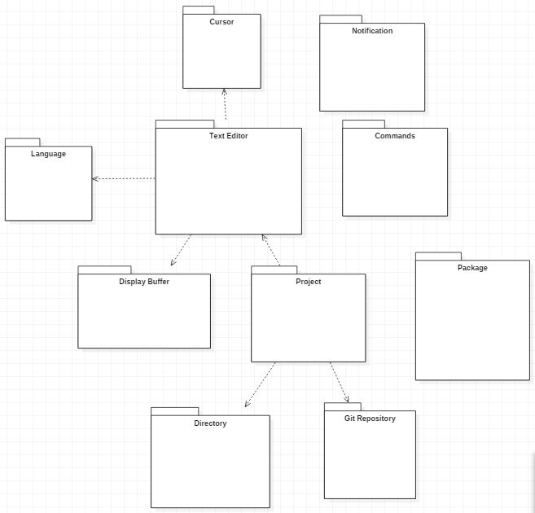
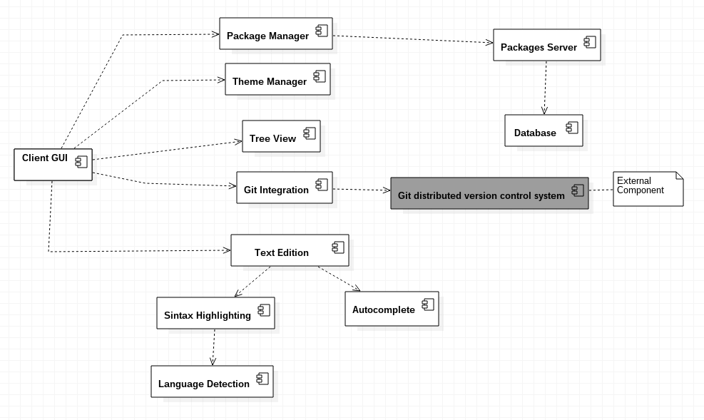
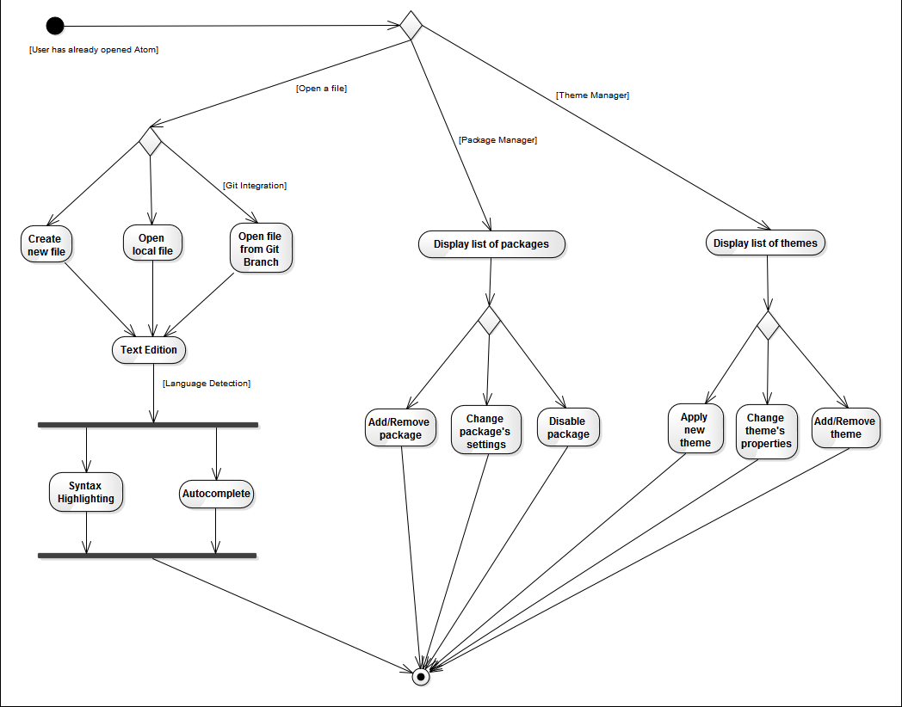
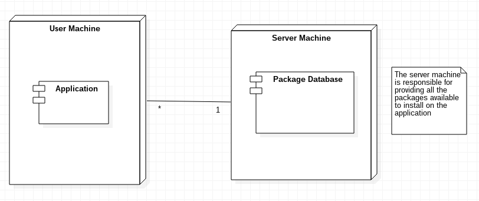

# 4+1 view model of software architecture
## Logical View
Shows the key abstractions in the system as objects or object classes, or their packages.

## Implementation View
Shows how the software is decomposed (into sw components) for development

## Process View
Shows how, at run-time, the system is composed of interacting processes.

## Deployment View
Shows the system hardware and how software components are distributed across the hw nodes

