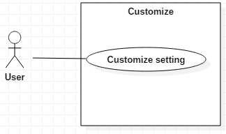
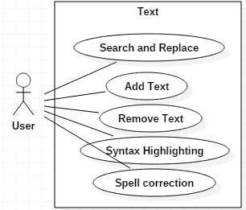

# Introduction
This sections gives a scope description and overview of everything included in this SRS document
## Purpose
The purpose of this document if to give a detailed description of the base requirements for [Atom](https://atom.io)  The hackable text editor. It will also ilustrate the use cases of the functional requirements.
## Scope
Atom is a text editor that provides the ability to create, edit and save text files. It also provides efficiency tools such as auto completion and language support.
Atom provides a users the possibility to create new functionalities,their own themes and all this can be shared with the community.
All these features make it a powerful tool to increase user productivity.
# Specific requirements
This section contains the main requirements of the system. It gives a detailed description of the system and the base features.
## System features
### Functional requirements
#### Customize the editor appearance
#### Description
The user must be able to choose and create different color themes. Variety of choice on font styles and sizes.
#### Reason
Give the user the most comfortable graphical interface.
#### Use Case

#### Create, Open, Save and Close files
##### Description
The user must be able to create, open, save and close files in a specified directory.
#### Reason
Removes the need to leave the editor to create files.
#### Use Case

#### Git integration
##### Description
The editor must display the current status of the git repository and line diffs.
#### Reason
User has on screen information about changes made since last commit.
#### Use Case

#### Text edition
##### Description
The editor must provide word completion for main programming languages, ability to add, edit and delete text.
#### Reason
Main functionality of the editor.
#### Use Case

