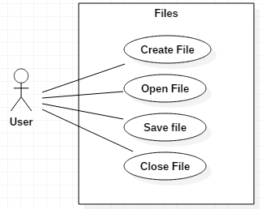

# Introduction
This sections includes the purpose and scope of this SRS and an overview of Atom.
## Purpose
The purpose of this document is to serve as a guide to designers, developers and testers who are responsible for the engineering of Atom.
## Scope
This document contains a small description of the functionality of Atom. It consists of use cases, functional and non-functional requirements.
## System overview
Atom is the "hackable text-editor", it allows users to customize its GUI and add functionalities.
It's a text editor that provides the ability to create, edit and save text files. It also provides efficiency tools such as auto completion and language support.
Atom provides a users the possibility to create new functionalities and their own themes. All of this can be shared with the community.
These features make it a powerful tool to increase user productivity.
# Specific requirements
This section contains the main requirements of the system. It gives a detailed description of the system and the base features.

#### Git integration
##### Description
The editor must display the current status of the git repository and line diffs.
#### Reason
User has on screen information about changes made since last commit.
#### Use Case

# Use Cases
Name   | Use case number and name
-------|-------------------------
Summary|
Rationale|
Users|
Preconditions|
Basic Course of Events|
Alternative Paths|
Postconditions|

## UC1
Name   | UC1: Search and Replace
-------|-------------------------
Summary|Occurrences of a search term are replaced with replacement text.
Rationale|While editing a document, users may find the need to replace some text in the document. Since manually looking for the text is very inefficient, Search and Replace allows the user to automatically find the text, and replace it. Sometimes there are many occurrences, and the user may choose to replace all of them, or one at a time. The user may also not replace any text, and just find its location.
Users|All users.
Preconditions|A document is loaded and being edited.
Basic Course of Events|1. The user indicates that the software is to perform a search and replace in the active document. 2. The software responds by requesting the search term and the replacement text. 3. The user inputs the search term and replacement text. Then, indicates that all occurrences are to be replaced. 4. The software replaces all occurrences with the replacement text.
Postconditions|All occurrences of the search term have been replaced with the inputted text from the user.
Alternative Paths|1. In step 3, the user may indicate that only the first occurrence is to be replaced. The postcondition state is identical, except there is only one replace. 2. In step 3, the user may choose not to replace any text, but only to find it. In this case, the software highlights all occurrences in the active document. 3. The user can decide not to find or replace any text. In this case, the software simply returns to the precondition state.

Name   | UC2: Change GUI theme
-------|-------------------------
Summary|GUI appearance changes to a specified theme.
Rationale|The user may enjoy working with different font or background colors, atom provides different color themes for the user interface (tabs, status bar, tree view and dropdowns) and for the text inside the editor.
Users|All users.
Preconditions|Atom is running
Basic Course of Events|1. The user indicates to the software the intention of changing the theme. 2. The software responds by showing all the themes available to apply.  3. The user inputs the theme he wishes to use. 4. The software replaces the current theme with the theme chosen by the user.
Postconditions|Theme is changed to the one selected by the user.
Alternative Paths|1. In step 3, the user may cancel the action and the current theme continues to be active.

Name   | UC3: Add functionality
-------|-------------------------
Summary|A new functionality is added to the editor.
Rationale|The standard version of the software may not have some specific functionality desired by the user, the user can add the desired functionality if it is available to install.
Users|All users.
Preconditions|Atom is running and has Internet access.
Basic Course of Events|1. The user indicates to the software the intention of installing a new feature. 2. The software responds by requesting the user the search term that describes the feature.  3. The software displays all the features matching the search term.   4. The user selects the feature desired.   5. The software downloads and installs the feature selected.
Postconditions|The feature selected is installed and ready to be used.
Alternative Paths|1. In step 3, the user may input a different search term and the software will display the new corresponding features.  2. In step 2, 3 or 4 the user may choose to cancel the operation.

Name   | UC4: Create functionality
-------|-------------------------
Summary|New functionality/feature is created by a user.
Rationale|A user wants to use a functionality that does not come with the standard version of the software nor is available for installment. If the user wants to he can create a new functionality.
Users|All users.
Preconditions|None
Basic Course of Events|1. User creates the functionality using development services provided by the software.  2. User adds the newly created functionality to the available features to install on the software.
Postconditions|The feature created is available to be added to the software.
Alternative Paths|1. The user may not share his newly created functionality with other user by making it available for installment on the software.

[testLink](#use-cases)

Name   | UC5: Syntax Highlighting
-------|-------------------------
Summary|Highlight certain syntax of given languages
Rationale|While editing a file, users may choose to highlight text in said file according to a language's syntax. Since manually looking through all the text to find certain term is inefficient, Sintax Highlighting automatically highlights a chosen language's syntax in the active file.
Users|All users.
Preconditions|A document is loaded and being edited.
Basic Course of Events|1. The user indicates that the software is to highlight syntax in the active document.  2. The user indicates what is the language to be highlighted in the active file.
Postconditions|All occurrences of the language's syntax have been highlighted.
Alternative Paths|1. In step 1, the software may already be highlighting syntax in the active document, with the wrong language. The user proceeds to step 2. 2. In step 1, the user may choose to turn off syntax highlighting. All previously highlighted terms cease to be highlighted. 3. In step 1, the software may already be highlighting syntax in the active document, with the right language. The user does not have to interact with the software to achieve the desired effect.

Name   |UC6: Load File
-------|-------------------------
Summary|Files are loaded in the text editor.
Rationale|The user may want to edit it an already existing file.
Users|All users
Preconditions|Software is loaded.
Basic Course of Events|1. The user indicates that the software is to open a file. 2. The user indicates what file is to be opened.
Postconditions|The file is opened and is now editable.
Alternative Paths|1. In step 2, the user may choose not to open any file, in which case the software returns to the precondition.

Name   |UC7: Save File
-------|-------------------------
Summary|Files are saved in the system.
Rationale|After editing a file, the user may want to save its changes for later use. The user is also able to create new files by saving with a new name or editing text that isn't already associated with a file.
Users|All users
Preconditions|Software is loaded and a file is being edited.
Basic Course of Events|1. The user indicates that the software is to save the file. 2. The user indicates the name and extension that the file is to be saved as.
Postconditions|The file changes are now saved in the system, the file name is updated in the editor to match the saved value.
Alternative Paths|1. In step 2, the user may choose not to save the file, in which case the software returns to the precondition. 2. In step 2, the user may choose to save the file being edited with the same name and extension, not needing to indicate those values. In this case, the filename isn't updated in the editor, as it stays the same.

Name   |UC8: Add Text
-------|-------------------------
Summary|Adds text to the file that is loaded and being edited.
Rationale|To implement a text editor the user must be able to add text to the document he wants to edit.
Users|All users
Preconditions|A file is loaded and being edited.
Basic Course of Events|1. The user specifies the positions where text is to be added.   2. The user inputs a character.   3. The software adds the character to the position specified.
Postconditions|The character is added to the position specified.
Alternative Paths|1. In step 2, the user may paste a sequence of characters instead of just one character, this implies that the sequence is added to the position specified.  2. If in step 2 there is some text selected all the text is replaced after the user inputs the character.  3. In step 2 if text is selected and the user pastes a sequence of characters all the selected text is replaced by the sequence of characters.

Name   |UC8: Remove Text
-------|-------------------------
Summary|Removes text from the file that is being edited.
Rationale|To implement a text editor the user must be able to remove text that is on the file.
Users|All users
Preconditions|A file is loaded, being edited and has content.
Basic Course of Events|1. The user specifies the positions where text is to be removed.   2. The user indicates the software to remove one character.   3. The software removes the character on the position specified.
Postconditions|The character is removed from the position specified.
Alternative Paths|1. If in step 2 there is some text selected all the text is removed after the user inputs the wish to remove text.

# System requirements
Name   |Name and number of requirement
-------|------------------------------
Summary|Brief description of the requirement
Rationale|Description of the reason that the requirement is needed
Requirements|The behavior that is required of the software
References|Use cases and other requirements which are relevant to this one [testingRef](#uc1)
