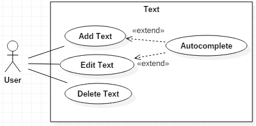

# Introduction
This sections includes the purpose and scope of this SRS and an overview of Atom.
## Purpose
The purpose of this document is to serve as a guide to designers, developers and testers who are responsible for the engineering of Atom.
## Scope
This document contains a small description of the functionality of Atom. It consists of use cases, functional and non-functional requirements.
## System overview
Atom is the "hackable text-editor", it allows users to customize its GUI and add functionalities.
It's a text editor that provides the ability to create, edit and save text files. It also provides efficiency tools such as auto completion and language support.
Atom provides a users the possibility to create new functionalities and their own themes. All of this can be shared with the community.
These features make it a powerful tool to increase user productivity.
# Specific requirements
This section contains the main requirements of the system. It gives a detailed description of the system and the base features.
## System features
### Functional requirements
#### Customize the editor appearance
#### Description
The user must be able to choose and create different color themes. Variety of choice on font styles and sizes.
#### Reason
Give the user the most comfortable graphical interface.
#### Use Case

#### Create, Open, Save and Close files
##### Description
The user must be able to create, open, save and close files in a specified directory.
#### Reason
Removes the need to leave the editor to create files.
#### Use Case

#### Git integration
##### Description
The editor must display the current status of the git repository and line diffs.
#### Reason
User has on screen information about changes made since last commit.
#### Use Case

#### Text edition
##### Description
The editor must provide word completion for main programming languages, ability to add, edit and delete text.
#### Reason
Main functionality of the editor.
#### Use Case

# Use Cases
Name   | Use case number and name
-------|-------------------------
Summary|
Rationale|
Users|
Preconditions|
Basic Course of Events|
Alternative Paths|
Postconditions|

Name   | UC1: Search and Replace
-------|-------------------------
Summary|Occurrences of a search term are replaced with replacement text.
Rationale|While editing a document, users may find the need to replace some text in the document. Since manually looking for the text is very inefficient, Search and Replace allows the user to automatically find the text, and replace it. Sometimes there are many occurrences, and the user may choose to replace all of them, or one at a time. The user may also not replace any text, and just find its location.
Users|All users.
Preconditions|A document is loaded and being edited.
Basic Course of Events|1. The user indicates that the software is to perform a search and replace in the active document. 2. The software responds by requesting the search term and the replacement text. 3. The user inputs the search term and replacement text. Then, indicates that all occurrences are to be replaced. 4. The software replaces all occurrences with the replacement text.
Postconditions|All occurrences of the search term have been replaced with the inputted text from the user.
Alternative Paths|1. In step 3, the user may indicate that only the first occurrence is to be replaced. The postcondition state is identical, except there is only one replace. 2. In step 3, the user may choose not to replace any text, but only to find it. In this case, the software highlights all occurrences in the active document. 3. The user can decide not to find or replace any text. In this case, the software simply returns to the precondition state.
