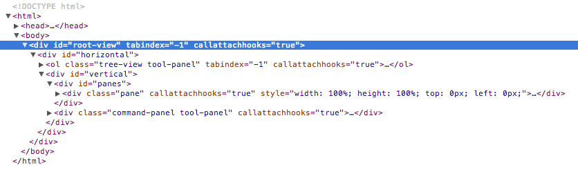

# A Guide to Atom's Internals

## Views

### SpacePen Basics

Atom's view system is built around the [SpacePen](http://github.com/nathansobo/space-pen)
view framework. SpacePen view objects inherit from the jQuery prototype, and
wrap DOM nodes

View objects are actually jQuery wrappers around DOM fragments, supporting all
the typical jQuery traversal and manipulation methods. In addition, view objects
have methods that are view-specific. For example, you could call both general
and view-specific on the global `rootView` instance:

```coffeescript
rootView.find('.editor.active') # standard jQuery method
rootView.getActiveEditor()      # view-specific method
```

If you retrieve a jQuery wrapper for an element associated with a view, use the
`.view()` method to retrieve the element's view object:

```coffeescript
# this is a plain jQuery object; you can't call view-specific methods
editorElement = rootView.find('.editor.active')

# get the view object by calling `.view()` to call view-specific methods
editorView = editorElement.view()
editorView.setCursorBufferPosition([1, 2])
```

Refer to the [SpacePen](http://github.com/nathansobo/space-pen) documentation
for more details.

### RootView

The root of Atom's view hiererchy is a global called `rootView`, which is a
singleton instance of the `RootView` view class. The root view fills the entire
window, and contains every other view. If you open Atom's inspector with
`alt-meta-i`, you can see the internal structure of `RootView`:



## Models