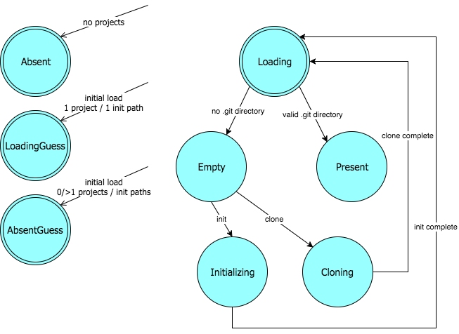

This directory contains the various states that a `Repository` model can assume. Each state subclasses [`State`](./state.js), which provides each state with:

* Trivial implementations of the state-dependent Repository functionality that return "empty" results where possible; Promises that resolve to empty arrays, null-object `Remote` or `Branch` implementations, `false`. This allows the UI components to freely query the current Repository for data regardless of whether an actual git repository exists or not.
* Action and transition methods that throw exceptions or reject Promises.
* UI state probe methods to allow individual states to customize the way that certain UI components respond while each state is active. For example, if `showGitTabLoading` is overridden to return `false`, the `.is-loading` class is added to the Git tab DOM node to allow it to be styled differently.

Here's the current state transition diagram:

Only the initial states (`Absent`, `AbsentGuess`, `Loading`, and `LoadingGuess`) are exported from the directory module.
